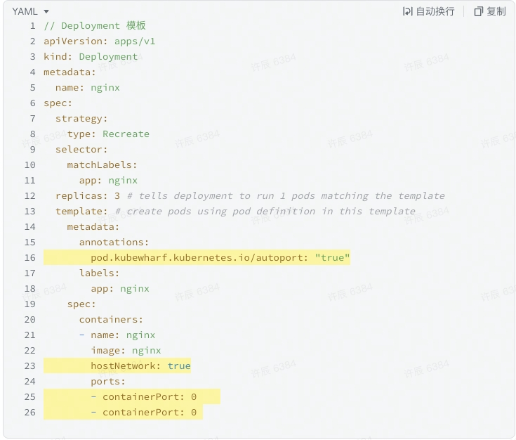
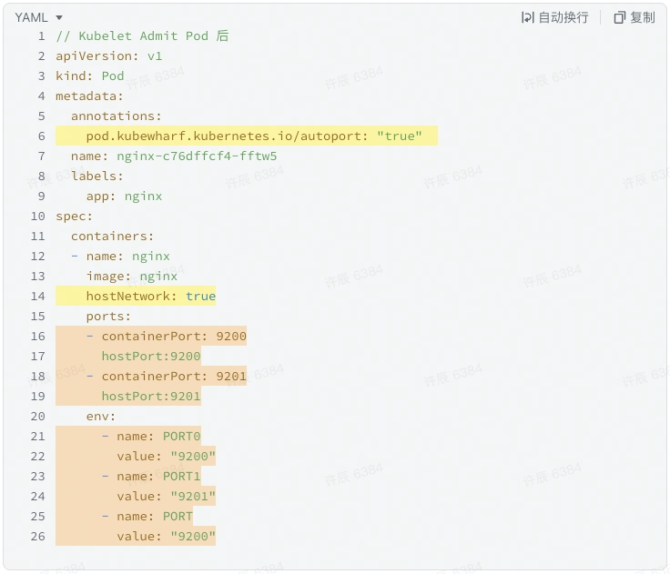
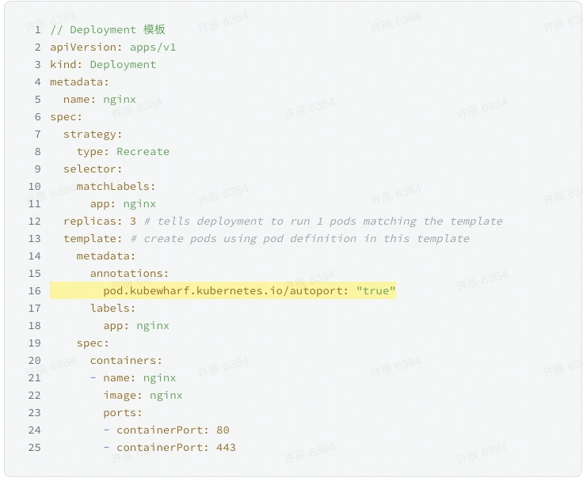
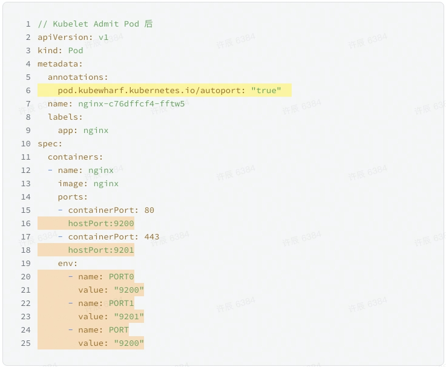

# 背景和问题
Kubernetes 是为运行分布式应用而建立的，分布式系统的本质需要容器之间网络互通，所以网络是 Kubernetes 的核心和必要组成部分，同时也是 Kubernetes 中最为复杂的部分之一。Kubernetes 本身并没有自己实现容器网络，而是借助 CNI 标准，通过插件化的方式来集成各种网络插件，实现集群内部网络相互通信。主流的网络方案包括 Flannel、Calico 、Cilium等。Kubernetes 的网络模型比较复杂，涉及到容器到容器的网络、Pod 到 Pod 的网络、Pod 到 Service 的网络、互联网到 Service 的网络等多个方面。目前，Kubernetes 的网络实现有以下一些问题：
1. 性能开销大。基于 vxlan 或者 ipip 等模式的虚拟⽹络，在容器跨宿主机通信时，存在网络包的封包和拆包操作，性能损耗⼤，引起时延上涨。此外，在 Kubernetes 集群中有⼤量服务和容器的时候，单机 iptables 规则会⾮常多，这对⽹络的性能损耗同样很⼤。
2. 技术选型成本高。选择合适的 CNI 插件， 需要综合考虑底层网络拓扑基础设施，结合应用需要的网络功能，以及网络路由协议的需求，确定容器网络方案。很多网络插件又支持多种模式，需要大量的网络的基础知识支撑才能了解清楚。此外，部分 CNI 由于用到高级内核特性，对主机系统版本也有要求。
3. 排查问题困难。对网络技术非常熟悉的人员相对较少，和 Kubernetes 结合后能彻底将网络掌握透彻就更不容易。网络又是 Kubernetes 集群中最容易出问题的一个部分，涉及的概念、模块和组件众多，网络流量的可见性较低。同时 CNI 、DNS、Service 的实现又分布在不同的项目，一旦网络出现问题，排查需要游走多个组件间，定位问题困难，耗时长、效率低。
4. 集群内外访问困难。私有云环境中，⾮ Kubernetes 集群的机器，访问集群内容器的 IP 地址很困难，不利于开发调试和问题定位。同时在容器迁移过程中，部分服务同时部署在 Kubernetes 集群内部和外部，增加了服务注册中心的对接难度与 Service Mesh 的统一治理成本。
5. 跨集群网络复杂。Kubernetes 网络让容器可以在同一集群中的多个节点运行并相互通信，但是不同的 Kubernetes 集群中运行的容器想要实现互相通信，实现的方法依然需要通过 ingress controller 或者节点端口来完成。Kubernetes 集群之间的网络连接成本高，提高了多集群部署、跨云部署的难度。

# 解决方案
Kubernetes 的目的之一是在应用之间共享机器，共享机器需要应用之间不能使用相同的端口。但是在多个应用开发者之间去大规模地协调端口是件很困难的事情。为了解决网络以及端口冲突问题，我们提出了一种动态分配端口的机制为应用自动协调和设置端口，通过容器环境变量暴露给用户使用。自动端口分配 feature 具有以下特点：
1. 通过 pod annotation 开启自动端口分配特性，对用户使用入侵极小。
2. Kubelet admit Pod 时在单机范围内动态分配端口，避免主机端口分配重复。支持设置分配端口范围，支持单 Pod 多端口分配。
3. 解决了 Host 网络模式下 Pod 端口冲突的问题，有效减少网络性能损耗。
4. 支持容器非 Host 网络模式，支持单机 ebpf Bridge 网络加速。
5. 兼容 Service 、Endpoint 等 Kubernetes 原有语义；兼容 CoreDNS、KubeProxy 等组件；兼容系统原有 CNI。
## 实现原理
代码逻辑分为 Kubelet 和 kube-apiserver 两个部分：
- 在 Kubelet 侧：增加了一个新的 Pod Admit Handler，在 Kubelet Admit Pod 时，从本机上选择出可用端口分配给 Pod，然后修改 Pod Spec 中 Container ports/ env 相关字段，填充分配端口的信息。之后在 Kubelet 调用 CRI 接口启动容器时，分配的端口信息会传递给底层 Runtime 完成容器创建。
- 在 kube-apiserver 侧：适配了 Pod validation 逻辑与相应权限，允许 Kubelet 修改 Pod Spec 中 Container ports/ env 相关字段。
更多细节见代码 repo

## 使用样例
### Host 网络模式
对于 Host 网络模式，需要在 Deployment 等 workload 的 Pod Template 中
1. 设置 Pod Annotation pod.kubewharf.kubernetes.io/autoport: “true”
2. 设置 hostNetwork 为 true
3. 设置 containerPort 和 hostPort 为 0

在调度器调度节点完成，节点上的 Kubelet Admit Pod 后，containerPort 和 hostPort 被设置成分配的端口值，且 containerPort == hostPort。同时对应端口信息会体现在环境变量中，业务代码从环境变量中读取对应的端口信息，然后 Listen 监听相关端口。

|       |  |
| ----------- | ----------- |
 
 (黄色部分代表配置项，棕色部分代表 Kubelet Admit Pod 时的修改）

### 非 Host 网络模式
对于非 Host 网络模式，需要在 Deployment 等 workload 的 Pod Template 中
1. 设置 Pod Annotation pod.kubewharf.kubernetes.io/autoport: “true”
2. containerPort 按照业务需求填写，比如 nginx 的 80/443 端口，hostPort 设置为 0

在调度器调度节点完成，节点上的 Kubelet Admit Pod 后，hostPort 被设置成分配的端口值，同时对应端口信息会体现在环境变量中。容器端口 containerPort 和主机端口 hostPort 之间的流量转发（DNAT 等），由单机 CNI 插件进行控制。

|       |  |
| ----------- | ----------- |

 (黄色部分代表配置项，棕色部分代表 Kubelet Admit Pod 时的修改）

# 效果
通过自动端口分配特性，有效解决了当前 Kubernetes 网络中的几个问题：
1. 简化 Kubernetes 网络模型，降低复杂度
2. 提高网络性能，降低应用延迟
3. 减少网络组件运维管理成本
4. 降低网络问题定位排查难度
5. 提高集群内外、集群之间的网络连通性，提高服务治理能力
6. 降低容器化迁移成本

未来，KubeWharf 也会开源 CNI 项目 Carma，提供单机 Bridge 网络的 ebpf 加速，性能大幅优于 calico 和 flannel。此外，也会基于 ebpf 提供 bind 的 hook 劫持功能，减少对用户代码使用分配端口的入侵。
